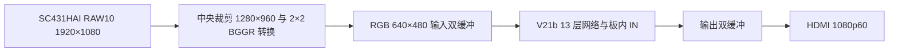

# Ti60F225 三风格摄像头项目交接文档

交接日期：2026-10-06（北京时间）。交接源码基线：`ddded2fb70d087d408db1341c041fbf9acbfe913`。
仓库：[icy768/ti60f225-AI-drawing](https://github.com/icy768/ti60f225-AI-drawing)。本文所述验收对应 **V21b 网络／SCU09 固件**。
本文依据已保存的源码、发布清单和验收记录整理；本次交接整理没有重新编译或烧录。

## 1. 接手后先看这里

| 项目 | 当前结论 |
|---|---|
| 整机入口 | [StyleCam_camera/ti60f225_oob.xml](../StyleCam_camera/ti60f225_oob.xml)，顶层 `ti60f225_oob_top` |
| FPGA | Efinix Titanium Ti60F225，工程时序模型 I3 |
| 网络 | `v21b_ukiyoe_qat900_640x480`，固定 C24/Fc16、13 层、三种风格 |
| 输入／输出 | 原厂 SC431HAI 实时摄像头；网络 RGB 640×480；HDMI 1920×1080、60 Hz |
| 实板状态 | SCU09 已固化到 Flash 地址 0，并通过独立回读及配置复位后的自主启动验收 |
| 启动方式 | 上电或按 RESET_N 自动加载 SCU09，启动摄像头、板内 IN 和风格处理，默认梵高 |
| 风格切换 | KEY3／SW3 短按：梵高 → 浮世绘 → 水墨山水 → 梵高 |
| 当前速度 | 摄像头约 30.009 fps，风格输出约 15.004 fps，稳定板内一次处理约 58.69 ms |
| 当前可靠性证据 | 保存的约 30 秒实板测量中，捕获、溢出、网络、DDR 和 HDMI 欠流错误均为 0；用户确认三风格和按键正常 |
| 分支 | `main` 保存已验收版本，`develop` 用于后续开发；交接整理前两者同步 |

当前功能已经可以用于实时风格视频演示。后续优先保持整机可运行；硬件资源需满足题目限制，但资源压缩不是当前最高优先级。

## 2. 目录与版本边界

以下路径均相对于仓库根目录；本机统一工程位于桌面 `FPGA/FPGAProjects`。

| 路径 | 用途 |
|---|---|
| [FPGAProjects/StyleCam_camera](../StyleCam_camera/README.md) | 当前完整整机：摄像头、网络、板内 IN、DDR 双缓冲、HDMI、按键、调试工具 |
| [FPGAProjects/StyleCam](../StyleCam/README.md) | V21b 训练、整数参考、量化参数和成套网络导出；整机使用此版参数 |
| [FPGAProjects/sc431hai_hdmi](../sc431hai_hdmi/README.md) | 已调通的独立摄像头参考例程，可用于隔离摄像头／HDMI 问题 |
| [FPGAProjects/烧录文件/20261006_SCU09_V21b_摄像头版](../烧录文件/20261006_SCU09_V21b_摄像头版/README.md) | 当前已验收 BIT、HEX、发布清单 |
| [FPGAProjects/烧录文件/20261006_SCU08_V6_摄像头修复版](../烧录文件/20261006_SCU08_V6_摄像头修复版/README.md) | 旧 V6／SCU08 恢复包；使用它会回退网络版本 |
| [FPGAProjects/tools](../tools/README.md) | 共用仿真工具说明；Icarus 二进制只保存在本机 |
| `FPGAProjects/_archive/恢复资料_20261006` | 本机历史源码 ZIP、旧提交 bundle、厂家例程和清理记录；不提交 GitHub |

`StyleCam/syn/vision_map.xml` 是网络交付的视觉子系统入口。该目录 README、audits、BSP／ELF 中保留了原交付阶段的限制；当前摄像头整机状态应查 `StyleCam_camera` 的结果。
整机使用全 RTL 执行和板内 IN，不依赖 CPU／ELF，也无需电脑上传图片或 IN 系数。

旧桌面“FPGA创新赛”内容已经清空，没有运行依赖，可以删除。交接文档生成时空目录仍存在，用户可以手动删除；开发和烧录文件统一使用 `FPGAProjects`。

## 3. 数据链路与关键代码



- 预处理沿用已验收摄像头链路：中央裁剪、2×2 BGGR 转换、黑电平 16 和原 Gamma。
- 网络时钟 100 MHz。输入帧在本次 IN／推理期间保持锁定；完整输出写入 DDR 后才发布。
- 显示端在垂直消隐阶段切换输出帧银行；调度器等待 HDMI 接收新银行，避免写入仍在显示的帧。
- 首次使用每种风格需要 13 次推理完成 IN 校准；之后逐帧轮换更新 IN 层，供后续帧使用。首次切换需要等待，不能按稳定单次耗时理解整个启动过程。
- 显示读通道优先和 FIFO 调整已经修复此前明显黑线／闪烁问题；压力仿真可复现旧欠流，并验证当前修复。

| 文件（位于 StyleCam_camera） | 作用 |
|---|---|
| `rtl/ti60f225_oob_top.v` | 整机连接、时钟、摄像头、DDR、网络、HDMI 和串口 |
| `rtl/sc431hai/sc431hai_setup.v`、`sc_sequence.vh` | 传感器初始化与寄存器序列 |
| `rtl/sc_camera_rgb.v`、`sc_capture.v` | RAW 转 RGB、帧捕获与输入银行保护 |
| `rtl/sc_video_schedule.v`、`sc_button.v` | 三风格按键、帧调度和输出发布 |
| `rtl/stylenet_top.v`、`conv_layer.v`、`requant.v` | 13 层网络、卷积与整数重量化 |
| `rtl/sc_in_refresh.v`、`sc_in_math.v`、`sc_in_alu.v` | 板内统计、IN 校准和系数更新 |
| `rtl/sc_replay.v`、`sc_read_arbiter.v`、`sc_write_arbiter.v` | DDR 回放与读写仲裁 |
| `rtl/sc_display.v` | 输出双缓冲、2 倍显示和欠流记录 |
| `rtl/StyleCam_uart.v` | SCU09 身份、计数与调试协议 |
| `model/integration.json`、`qparams.json`、`net_blob.bin`、`*.mem` | 版本绑定、量化参数、权重、IN 常数和 ROM 初始化 |

## 4. 上电和演示操作

1. 保持原厂 SC431HAI、HDMI 显示器和板卡供电连接正确。JTAG USB 用于下载，串口 USB 用于检查；已经固化的整机可脱离电脑自动运行。
2. 上电或按一次 **RESET_N 配置复位键**，等待传感器初始化、DDR 就绪和默认梵高 IN 校准完成。
3. 移动镜头前的物体，确认风格画面随输入变化。
4. 短按 **KEY3／SW3** 切换风格，每次间隔约 2 秒；新风格首次使用时等校准结束，再判断切换结果。
5. KEY0 复位当前逻辑；RESET_N 重新从 Flash 加载。KEY0、RESET_N 均不用于切换风格。

图像不铺满 16:9 显示器是当前实现的预期行为：640×480 经最近邻 2 倍放大为 **1280×960**，居中显示于 1920×1080，左右各留 320 像素、上下各留 60 像素（另有细边框）。
这样保留 4:3 比例。后续若要求铺满，可选择等比例放大后裁剪或拉伸；目前未实现这些显示选项。

## 5. 当前烧录文件和核验值

发布目录：`FPGAProjects/烧录文件/20261006_SCU09_V21b_摄像头版`。

| 文件 | 用途 |
|---|---|
| [StyleCam_SCU09_V21b_SC431HAI_640x480.bit](../烧录文件/20261006_SCU09_V21b_摄像头版/StyleCam_SCU09_V21b_SC431HAI_640x480.bit) | JTAG 临时配置；RESET_N 或断电后恢复 Flash 中固化版本 |
| [StyleCam_SCU09_V21b_SC431HAI_640x480.hex](../烧录文件/20261006_SCU09_V21b_摄像头版/StyleCam_SCU09_V21b_SC431HAI_640x480.hex) | Flash 固化，地址 0 |
| [manifest.json](../烧录文件/20261006_SCU09_V21b_摄像头版/manifest.json) | 发布文件、资源、时序及验收摘要 |

已固化配置有效数据为 **1,058,000 字节**；BIT／HEX 是文本格式文件，文件大小约 3.17 MB，与有效配置字节数不同。
本次生成交接文档时，发布文件 SHA256 与下面记录一致。

| 对象 | SHA256 |
|---|---|
| BIT | `83ffe2006540cb03bd2321ad7e4f64063226b892cce610a5014463f934f27d14` |
| HEX | `246c29d253d1b5cfc384b0abd1cf2e600bc52e9de69e18983bf6b3f517b483f4` |
| 网络 blob | `9a1b2382e2c9953f775f5c9c7e5b06fd93e5cad9bcdffa8086dbbe41541a5d5b` |
| 模型 checkpoint | `d0d19437fa91a8424a38baddc2f03d2bbf79bb6a93da94342fb8bef97fd907eb` |

SCU09 实读身份：`534355098002e0011b00030d`。身份用于识别固件，具体权重版本以模型／发布文件 SHA256 配套核验。

## 6. 下载、固化和恢复流程

下列 PowerShell 命令从仓库根目录进入当前工程后执行。本机 Python／Efinity 路径见第 7 节；换电脑需调整安装路径。

### 6.1 调试时临时下载

如果仅克隆了仓库，`outflow` 构建中间产物不随 Git 提交。可先将已验收发布文件复制到脚本读取的位置：

```powershell
Set-Location .\FPGAProjects\StyleCam_camera
New-Item -ItemType Directory -Path .\outflow -Force | Out-Null
Copy-Item -LiteralPath '..\烧录文件\20261006_SCU09_V21b_摄像头版\StyleCam_SCU09_V21b_SC431HAI_640x480.bit' -Destination '.\outflow\ti60f225_oob.bit'
Copy-Item -LiteralPath '..\烧录文件\20261006_SCU09_V21b_摄像头版\StyleCam_SCU09_V21b_SC431HAI_640x480.hex' -Destination '.\outflow\ti60f225_oob.hex'
& 'D:\Anaconda\python.exe' -B .\program.py ram
```

上面复制步骤仅适用于恢复当前已验收发布包；完成新构建后应使用新产物及其新验收结果。
`program.py` 会检查固件、模型和 BIT／HEX 哈希。下载使用厂家 `Generic Board Profile Using FT4232H`，JTAG 时钟 1 MHz。
调试默认临时配置；该动作不修改 Flash。

### 6.2 需要固化时

在已经完成新版本离线检查和临时上板验收后执行：

```powershell
# 第一次固化前建立 Flash 备份；已有备份时保留它，脚本会拒绝覆盖。
& 'D:\Anaconda\python.exe' -B .\program.py backup
& 'D:\Anaconda\python.exe' -B .\program.py flash
& 'D:\Anaconda\python.exe' -B .\program.py verify
```

`backup`、`flash`、`verify` 都会临时下载厂家 JTAG-to-SPI 桥接逻辑。完成后需手动按 RESET_N 或断电重启，才能运行 Flash 内的整机程序。
独立回读一致后，还应运行第 8 节串口检查并看屏幕、测试 KEY3，才算完成固化验收。
当前 SCU09 已完成这些步骤；日常上电演示无需再次固化。

恢复当前版本优先使用 SCU09 发布包。旧 SCU08／V6 只用于回退定位；烧录脚本当前绑定 SCU09 校验，不能把旧包改名后直接套用。

## 7. 开发环境、构建和模型更新

| 依赖 | 当前使用方式 |
|---|---|
| Efinity | 2026.1；本机安装 `D:\ELS\efinity\2026.1`，`build.py`／`program.py` 中配置安装目录 |
| 普通 Python | 本机 `D:\Anaconda\python.exe`；串口工具还需 pyserial、NumPy、Pillow |
| 网络／IN 数值环境 | 本机 `D:\Anaconda\envs\pytorch_env\python.exe`；需要 PyTorch、NumPy、Pillow |
| Icarus Verilog | 13.0；放置于 `FPGAProjects/tools/iverilog/mingw64/bin`，二进制未提交 Git |
| 串口 | 本机 COM19、921600 波特率；换电脑以实际端口为准 |

从 `StyleCam_camera` 目录依次执行构建：

```powershell
& 'D:\Anaconda\python.exe' -B .\build.py interface
& 'D:\Anaconda\python.exe' -B .\build.py map
& 'D:\Anaconda\python.exe' -B .\build.py pnr
& 'D:\Anaconda\python.exe' -B .\build.py pgm
```

`build.py` 在 `$env:TEMP/stylecam_v21_camera_build` 的 ASCII 目录构建，规避工具对中文工程路径的兼容问题，再将 `outflow` 产物和日志保存回工程。
新环境如果 TEMP 路径含非 ASCII 字符，需要安排可用的 ASCII 临时目录。

数值和链路复验命令：

```powershell
& 'D:\Anaconda\envs\pytorch_env\python.exe' -B .\sim_video_engine.py
& 'D:\Anaconda\envs\pytorch_env\python.exe' -B .\sim_in_math.py
& 'D:\Anaconda\python.exe' -B .\sim_camera.py
& 'D:\Anaconda\python.exe' -B .\sim_display_pressure.py
& 'D:\Anaconda\python.exe' -B .\check_camera_report.py
```

`sim_in_math.py` 还读取 `StyleCam/data/val2017/000000000139.jpg`，该数据目录不提交 Git。接手者需要补齐同一验证图，或明确记录替代测试输入后重新验收。
其他三风格网络仿真使用脚本生成的测试图；保存的 9 帧对拍为小尺寸真实网络仿真，不能解释为 9 帧完整 VGA 逐像素硬件对拍。
`check_camera_report.py` 依赖当前源码、ASCII 构建镜像、完整 place／timing 报告及仿真结果。历史 JSON 摘要用于追溯，不能代替新构建的资源／时序检查。

更新网络时，必须成套同步生成顶层、权重 ROM、IN 系数、qparams、blob、量化 R／S、残差 K 和板内 IN Q40 常数／层移位，重新生成版本绑定与校验记录。
不要仅替换某一个权重文件。验收顺序为：数值对拍 → 摄像头／缓冲／显示仿真 → 完整编译和门禁 → 临时下载和实板三风格检查 → 固化、独立回读、复位启动。
`package_release.py` 用于导出匹配发布包；现有脚本固定 SCU09 名称和目录，新版发布应先修改版本及输出目录，保留本次验收包。

## 8. 实板检查和问题定位

在 `StyleCam_camera` 目录执行：

```powershell
& 'D:\Anaconda\python.exe' -B .\camera_monitor.py --port COM19 --wait 60 --seconds 30
```

该工具向 FPGA 查询状态，不上传 RGB 或写 IN；会更新本地 `results/camera_video_latest.json`，并保存带时间戳的记录。
检查 SCU09 身份、传感器初始化、帧计数递增、网络耗时、AXI 错误和 HDMI 欠流粘滞标志。更长连续检查可调整 `--seconds`。
脚本通过后仍需肉眼确认画面随输入变化，并用 KEY3 检查三种风格；单个风格请求索引不能独立证明该风格正确显示。

| 现象 | 首先检查 |
|---|---|
| 显示器无信号 | HDMI 和供电连接、显示器输入源；确认下载完成后已退出 Flash 桥接状态并配置复位；查询是否为 SCU09 |
| 只有彩条或暂未出风格图 | 传感器 setup 状态、DDR 就绪、首风格 IN 校准是否完成、processed 帧计数 |
| 图像不铺满屏幕 | 先核对第 4 节 1280×960 居中显示，当前属于预期布局 |
| 黑线、强闪烁或撕裂 | 欠流粘滞标志、underflow_pixels、AXI 错误；保留异常记录，再检查 DDR 仲裁、FIFO 和输出银行切换 |
| 画面变化约 15 fps | 当前实测吞吐；摄像头约 30 fps，无法接收的帧会被跳过，显示端重复最近完整帧 |
| 复位后版本变化 | 临时 BIT 不保存；RESET_N 会加载 Flash，核对最近实际固化的版本 |
| KEY3 未立即切换 | 检查是否按到 KEY0／RESET_N，以及该风格首次校准是否完成 |
| 串口检查失败 | 端口／921600 波特率、是否被其他终端占用、SCU09 身份和工具所需依赖 |

主动跳过摄像头帧与 HDMI 像素欠流是不同指标：当前 15 fps 输出会少于传感器 30 fps，但已经完成的帧应完整显示；明显黑线或强闪烁仍需定位。

## 9. 已完成验收及证据边界

| 检查 | 已保存结果 | 证据 |
|---|---|---|
| 三风格真实网络／动态 IN | 9 帧、6,912 像素、936 系数完全一致；含无复位切换和背压 | [video_engine/result.json](../StyleCam_camera/validation/video_engine/result.json) |
| IN 数学 | 3,273 向量完全一致，含 VGA 统计、随机、全黑／全白及边界条件 | [in_math/result.json](../StyleCam_camera/validation/in_math/result.json) |
| 摄像头／帧捕获／调度 | 摄像头适配、帧保护和银行调度通过 | [camera_sim/result.json](../StyleCam_camera/validation/camera_sim/result.json) |
| 显示压力 | 81,920 像素一致、欠流 0；旧实现欠流可复现 | [display_pressure/result.json](../StyleCam_camera/validation/display_pressure/result.json) |
| 完整编译 | interface／map／pnr／pgm 通过；资源不超量、setup／hold 正余量 | [offline_check.json](../StyleCam_camera/results/offline_check.json) |
| 临时配置实际画面 | 用户确认三风格正常，KEY3 三次返回梵高 | [visual_acceptance.json](../StyleCam_camera/results/visual_acceptance.json) |
| Flash 固化 | 地址 0；1,058,000 字节独立回读全部一致 | [flash_deployment.json](../StyleCam_camera/results/flash_deployment.json) |
| Flash 配置复位后启动 | SCU09 自主摄像头启动，无主机 RGB／IN 上传；约 30 秒稳定运行 | [flash_boot_validation.json](../StyleCam_camera/results/flash_boot_validation.json)、[camera_video_latest.json](../StyleCam_camera/results/camera_video_latest.json) |

固化后保存的定量帧率窗口为梵高索引 0；三种风格视觉／KEY3 验收是另一次临时配置下的用户反馈。当前没有三种风格各自长时间实测报告。
这些结果证明已测范围内的功能和稳定性；尚未完成数小时连续运行、各种光照／快速运动场景、完整比赛条款逐项映射和整机功耗测试。

## 10. 性能和资源

| 指标 | 已验收值 | 理解方式 |
|---|---|---|
| 摄像头帧率 | 30.0089 fps | 原始传感器输入帧计数 |
| 风格输出帧率 | 15.0044 fps | 30.391 秒内完成 456 帧 |
| HDMI 刷新 | 1080p60 | 显示刷新；相同风格输出帧会重复显示 |
| 稳定一次板内处理 | 约 58.69 ms | 板内计数得到的一次稳定处理耗时；不是实测完整端到端时延 |
| 网络时钟 | 100 MHz | 当前验收配置 |
| XLR | 57,258 / 60,800（94.17%） | 余量 3,542 |
| RAM10 | 252 / 256（98.44%） | 余量 4，新增缓存需特别核算 |
| DSP | 117 / 160（73.12%） | 余量 43 |
| 最小 setup／hold 余量 | +0.172 ns／+0.012 ns | 当前构建通过；新改动需重新检查 |

当前已经完成实时视频链路，稳定单次处理不是早期提到的 60 秒。首次 IN 校准和稳定逐帧处理应分别测量；完整相机到屏幕时延尚无专门测量。
资源符合当前器件容量。比赛若另有资源或帧率指标，需要按原题目逐项对照，不能仅凭器件未超量认定全部达标。
若后续要求 30 fps 风格输出，需先测明网络计算、DDR 和调度开销，再制定优化方案；目前没有给出达到 30 fps 的工期承诺。

## 11. Git 协作与本地恢复资料

- 日常稳定基线从 `main` 获取；后续修改进入 `develop` 或明确用途的短期分支，验收后再合并。
- 三个旧远程分支已清理：`ai/stylecam-v6-handoff-20261004`、`ai/stylecam-v21-handoff-20261005`、`archive/imx219`；其已合并历史仍可在主分支追溯。
- 发布包、RTL、匹配模型、脚本和验收摘要已提交 GitHub。Efinity、Icarus 二进制、Python 环境、数据集、原始构建缓存和历史恢复资料需在接手电脑另行准备。
- 本机历史源码 ZIP 为 `历史工程源码与验收摘要_20261006.zip`，含 5,172 文件，逐文件 SHA256 已验证；旧 SCU08 完整源码在其中 `StyleCam_v8_camera_SCU08_V6` 子目录。
- 两个旧提交备份为 `legacy-local-commits.bundle`、`local-main-before-integration.bundle`；厂家原始参考为 `厂家SC431HAI参考例程_v3.zip`。全部位于本机 `_archive/恢复资料_20261006`，未上传 GitHub。
- 历史摘要中的 `_archive/StyleCam_v8_camera_SCU08_V6` 或 `baseline_root` 表示当时来源；整理后的恢复位置是上面的 ZIP，当前运行和构建不依赖旧目录。

交接前建议把该恢复资料文件夹另外备份一份；新机器只克隆 GitHub，无法得到这些本机归档。

## 12. 下一位接手者的待办

1. 按第 4、8 节先复现当前演示，确认 SCU09、三风格、KEY3、帧率和欠流结果。
2. 保存当前发布包和本机恢复资料，补齐新电脑工具及 IN 验证图片。
3. 根据比赛原题建立逐条验收清单，确认三风格、分辨率、帧率、资源、操作方式及提交材料要求。
4. 对三种风格分别做较长连续运行，覆盖光照变化和快速运动；记录帧率、跳帧、错误、欠流及实际画面。
5. 根据题目决定是否增加显示铺满选项，是否需要更快风格切换、30 fps 或端到端时延／功耗测量。
6. 新网络或 RTL 修改完成后执行第 7 节验收流程；调试优先临时下载，验收通过后再固化并重启核验。

其他入口：[统一工程说明](../README.md)、[工程整理与验收](工程整理与验收.md)、[整机验收报告](../StyleCam_camera/results/V21整合验收报告.md)、[Git 协作指南](../../docs/三人协作指南.md)。
