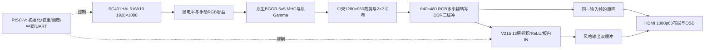

# Ti60F225 摄像头与三风格项目交接文档

交接日期：2026-10-09（北京时间）。适用分支：`feat/basic-requirements`。已固化源码基线：`77e58384185cfebf5548e6da325d3bd595f0c4f1`。

本文依据当前源码、08 发布包、仿真和实板日志整理。本次交接只整理文件与文档，不改变 FPGA/CPU 功能，也不重新烧录。2026-10-06 的交接文档对应历史全 RTL SCU09；当前版本已加入 RISC-V，操作以本文为准。

## 1. 接手先确认这些

| 项目 | 当前状态 |
|---|---|
| 唯一工程 | `C:\Users\lingye\Desktop\FPGA\FPGAProjects\StyleCam_camera` |
| Efinity 入口 | [ti60f225_oob.xml](../StyleCam_camera/ti60f225_oob.xml)，顶层 `ti60f225_oob_top`，Ti60F225 / I3 |
| Git | 根目录 `C:\Users\lingye\Desktop\FPGA`；[GitHub 分支](https://github.com/icy768/ti60f225-AI-drawing/tree/feat/basic-requirements) |
| 当前镜像 | `53430a08`：原生 BGGR，RGB 阶段水平翻转，RISC-V / V21b 三风格网络 |
| 画质 | 用户在重新临时加载同一 08 位流后确认“这回正常了” |
| 固化 | Flash 地址 0；1,073,814 字节独立回读逐字节一致；用户 RESET_N 后自主启动验收通过 |
| 权重 | Flash `0x200000`，48,616 字节、4050 条记录；CRC32 `373deed7`，写配置前后均一致 |
| 正式下载包 | [20261009_RISCV08_BGGR_RGBMirror](../烧录文件/20261009_RISCV08_BGGR_RGBMirror/README.md) |
| 启动布局 | VIEW=0，左原画/右风格；默认梵高 |
| 运行证据 | FPS=14.99、CAM=29.9、NN≈59.3 ms；ready=7，各链路错误为 0 |
| 本机串口/工具 | COM19，115200 8N1；Efinity `D:\ELS\efinity\2026.1` |

另一份 `C:\Users\lingye\Desktop\ti60f225-AI-drawing\FPGAProjects` 保留为用户此前指定自行删除的副本；本次不在其中开发或修改。该副本的 `sc431hai_hdmi` 是用户指定的摄像头对照工程。工程源文件、运行所需模型、ROM、IP 与当前烧录包均位于统一路径。

## 2. 当前功能与数据链路



- Sapphire RV32I，100 MHz，16 KB 片上 RAM；UART0 控制台、SPI0 读 Flash，APB 控制口 `0xF8100000`，PLIC 用户中断 A。
- C 程序下发 191 条摄像头初始化命令，包含读校验和延时；启动先用 `0xAB` 唤醒 Flash，再加载和 CRC 校验模型，避免配置启动后 Flash 休眠造成权重加载失败。
- 开机依次部署梵高、浮世绘、水墨三种风格。每种初始 IN 校准需要 13 遍处理，`ready` 依次为 1、3、7；之后逐帧轮换刷新 IN 系数。
- CPU 在帧发布中断中记录完成时间并启动下一帧；卷积、ReLU、IN、RAW→RGB、DDR 与 HDMI 在 FPGA 硬件中执行。
- 输入三缓冲保护正在推理和显示的原画；输出双缓冲在 HDMI 垂直消隐时切换。对比布局的两幅图来自同一输入帧。
- RAW 像素处理、乘加和后续阶段使用寄存器/流水线，DDR 采集、推理和显示通过缓冲及仲裁并发。当前性能还受单网计算和换帧等待影响。

## 3. 摄像头当前参数与修复结论

| 配置 | 当前值与含义 |
|---|---|
| 初始化序列 | 原摄像头例程 191 条命令，顺序、读校验与延时一致；执行主体为 RISC-V |
| 传感器水平镜像 | `3221=00`，保持原生输出方向 |
| 显示水平翻转 | `sc_capture` 的 `H_MIRROR=1`，每行 DDR 字地址和字内 4 个像素同时倒序；不额外使用图像 RAM |
| Bayer / 插值 | 原生 BGGR，完整四相位 5×5 MHC；对应增益颜色分类同步恢复 |
| 曝光 | `3e00/01/02=00/46/00`，1120 半行 |
| 模拟增益 | `3e08/09=83/20`，6.16 倍 |
| 数字增益 | `3e06/07=00/80`，1 倍 |
| RGB 手动增益 | Q8.8 `256/256/256`，三通道均 100% |
| 黑电平 / Gamma | 黑电平 16；原例程 Gamma，未降曝光或压低 G 通道来补偿 |
| 尺寸 | RAW10 1920×1080；中央 1280×960 经 2×2 RGB 平均变成 640×480 |
| CSI FIFO | 深度 1024；原例程 4096 会使集成工程 RAM 达 271/256，用户已确认保留 1024 |
| HDMI VIC | 0，与原摄像头参考对齐 |
| 自动曝光 / 自动白平衡 | 当前未实现；原例程 `rgb_gain_v1` 也是固定手动增益，不是 AWB |

原画发白的主要嫌疑是传感器镜像后的 RAW Bayer 相位或像素位置适配。08 恢复原生 BGGR，把方向调整放到 RGB 后，用户确认正常；正确的 RGB 翻转仅改变位置，不改变像素颜色和曝光。此前按假定 GBRG 相位通过仿真，不能单独证明传感器实物输出相位。

同一 08 位流第一次加载被反馈没有成功，重新加载后才获得正常反馈，因此不能认定 Bayer 相位适配是唯一原因，加载或显示状态也可能参与。FIFO 1024 在正常的 08 中保持不变，没有证据把稳定发白归因于 FIFO 深度。

FIFO 用于缓冲 CSI 数据到后续时钟域/处理阶段的瞬时速率差；无丢失时不会按比例改变颜色。深度不足可能导致溢出或丢帧，需结合错误计数和画面连续性判断。UART 的 `caperr=0` 不能代替未单独读出的 CSI 内部溢出状态。

`debug.json` 曾保存 280/255/350，但参考 RTL 默认和历史构建快照为 256/256/256，不能把调试配置文件的值当成实板生效值。详见 [摄像头修复记录](原生BGGR与RGB翻转验证_20261009.md) 和 [资源冲突记录](摄像头参考对齐与资源冲突_20261009.md)。

## 4. 上电、按键和串口

接好摄像头、HDMI 和板卡电源。已经固化的板子按 RESET_N 或重新上电后自动启动；USB 串口只用于观察/控制。启动包括 Flash 唤醒、权重加载、传感器配置和三风格部署，约数秒，等待 `streaming; commands:` 再验收。

| 操作 | 反应 |
|---|---|
| RESET_N / 重新上电 | 从 Flash 重新配置 FPGA，启动 08 |
| KEY3 | 梵高 → 浮世绘 → 水墨 → 梵高 |
| KEY2 | VIEW 0 对比 → VIEW 1 风格全屏 → VIEW 2 原画全屏 → 对比 |
| UART `0` / `1` / `2` | 选择对应风格 |
| UART `v` | 与 KEY2 相同，循环布局 |
| UART `s` | 打印状态 |
| UART `c` | 只读回读实际曝光、增益、镜像等传感器寄存器 |
| UART `w` | 暂停当前链路，重新读权重并部署三种风格 |
| UART `g 100 100 100` + 回车 | 按整数百分比设置 RGB；范围 0～25599 |
| UART `q 256 256 256` + 回车 | 设置原始 Q8.8；范围 0～65535 |
| UART `g?` / `q?` + 回车 | 查询通道增益 |
| UART `G` | 恢复三通道 100% |
| UART `h` / `?` | 打印命令帮助 |

RGB 在摄像头帧边界统一提交；它不是传感器曝光或模拟增益。为匹配原例程，通道值 0 的有效值是 255/256（约 99.6%），并非关闭该颜色。当前默认 100% 已随 ROM 固化，运行中改动复位后恢复默认。

KEY2 的逻辑和布局回归已通过；最新 08 复位日志 `k2=0`，只说明记录期间没有按键事件，不能用它证明物理按键已验收。接手短按一次 KEY2 看 `k2` 与 `view` 是否变化；再用 UART `v` 对照。`v` 正常而 `k2` 不变时，优先核对板上按钮名称、输入映射、去抖与中断。不要把复位键或其它按钮当成 KEY2。

## 5. 屏幕参数、串口计数与判断标准

| 参数 | 含义 / 判断 |
|---|---|
| FPS / `fps` | 风格帧发布速率；CPU 按发布帧数和首末发布时间计算，OSD 四舍五入到 0.1，UART 显示到 0.01，不是写死的 15 |
| CAM / `cam` | 传感器帧事件增量 / 约 1 秒统计窗；约 29.9～30，窗口和截断会产生 0.1 左右波动 |
| NN / `nn_ms` | 已发布帧的总硬件作业周期 / 100 MHz，包含该作业需要的网络遍次；稳定时约 59 ms |
| `pass_ms` | 最近单遍网络耗时；与多遍作业耗时不同 |
| `nn_max_ms` | 实时运行阶段记录的最大作业耗时 |
| STYLE / `style` | 0 梵高、1 浮世绘、2 水墨 |
| VIEW / `view` | 0 对比、1 风格全屏、2 原画全屏 |
| RGB | 手动通道增益；原例程默认各 100% |
| `ready` | 三种风格 IN 部署完成位图，7 表示全部就绪 |
| `proc` / `cap` | 已处理/已捕获帧累计值，应持续增长 |
| `skip` | 没有空闲输入银行时主动跳过整帧；摄像头约 30 而处理约 15，持续增加通常符合当前设计 |
| `caperr` / `vid_err` | 采集或视频链路错误；稳定运行应保持 0 |
| `uf` / `hdmi_err` | HDMI 欠流或 DDR 显示读写错误；稳定运行应保持 0 |
| `irq_err` | CPU 收到的错误事件累计数；正常应为 0 |
| `k3` / `k2` | KEY3 / KEY2 事件累计数，按对应按钮后检查是否增加 |
| `sw_us` / `sw_max_us` | 最近/最大风格切换完成延迟，微秒 |

NN 约 59 ms，加上 DDR 完成和等待 HDMI 换帧，当前组合约每 4 个 60 Hz 显示周期发布一帧，因此稳定约 15 FPS；摄像头仍约 30 FPS。HDMI 60 Hz 是显示扫描频率，不等于每秒产生 60 张新风格图。验收日志为 14.99，OSD 显示 15.0 属于正常舍入；若需要严格判定“≥15 FPS”，应测足够长窗口并按赛题规定的口径处理误差，不能仅依据 OSD 四舍五入。

观察稳定运行时 ID 正确、ready=7，`proc/cap` 持续增加、FPS/CAM 在上述范围、错误计数保持 0。复位刚开始的 0 FPS 是统计窗口尚未形成；风格部署或重载权重期间与稳定速率分别判断。

## 6. 下载、固化和新板部署

在 PowerShell 进入统一工程。`python` 应指定可用 Python 3；本机可用 `C:\Users\lingye\.cache\codex-runtimes\codex-primary-runtime\dependencies\python\python.exe`，中文输出建议 `-X utf8 -B`。

```powershell
Set-Location 'C:\Users\lingye\Desktop\FPGA\FPGAProjects\StyleCam_camera'
# 临时JTAG：断电或重新配置后恢复Flash中的版本
.\program_ram.ps1 -UartPort COM19 -EfinityHome 'D:\ELS\efinity\2026.1'
# 只读门禁：检查已验收位流、75个源码哈希和RAM启动日志
python -X utf8 -B program_flash_native.py --check-only
# 固化：先备份，再写配置，独立回读并核对权重区域
python -X utf8 -B program_flash_native.py --efinity 'D:\ELS\efinity\2026.1'
# 固化结束后桥仍占用FPGA：先监听，再按RESET_N或重新上电
.\verify_flash_boot.ps1 -UartPort COM19
```

当前板不需要重新写权重。新板缺少模型时，先枚举 JTAG 地址，再将模型写到 `0x200000`：

```powershell
& 'D:\ELS\efinity\2026.1\pgm\bin\ftdi_pgm.bat' -l
# --url必须使用本次枚举的JTAG地址；下面是当前板的记录值
python -X utf8 -B flash_blob.py --url 'ftdi://0x0403:0x6011:0:ff/1' --efinity 'D:\ELS\efinity\2026.1'
```

`flash_blob.py` 的默认 URL 是其它机器的旧值，必须显式指定；写完也需重新配置 FPGA。配置位流和模型权重分别位于 0 与 `0x200000`，二者都必须正确。先检查资源与时序、临时加载验收画面，再固化；Flash 脚本会拒绝与已验收源码/镜像哈希不符的候选。

已有 USB 串口被终端占用时先释放端口。COM19 不出现则重新枚举，不把其它 COM 口当成已经验证的端口。Python 监控脚本 `cpu_monitor.py` 需要 pyserial；本机用于烧录/复位验证的 PowerShell 工具不依赖 pyserial。

## 7. 源码位置、构建与验证

| 文件 | 作用 |
|---|---|
| [rtl/ti60f225_oob_top.v](../StyleCam_camera/rtl/ti60f225_oob_top.v) | 顶层连接、时钟、DDR、CSI、CPU、HDMI；原文件含 GB18030 注释，编辑需保留编码 |
| [rtl/sc_camera_rgb.v](../StyleCam_camera/rtl/sc_camera_rgb.v) | 黑电平、增益、BGGR MHC、Gamma、裁剪和平均 |
| [rtl/sc_capture.v](../StyleCam_camera/rtl/sc_capture.v) | RGB 翻转、DDR 捕获和三缓冲保护 |
| [rtl/sc_video_schedule.v](../StyleCam_camera/rtl/sc_video_schedule.v) | CPU启动、输入锁定、网络执行和显示换帧等待 |
| [rtl/sc_apb_regs.v](../StyleCam_camera/rtl/sc_apb_regs.v) | ID、CPU寄存器、I2C口、事件与RGB提交 |
| [C 主程序](../StyleCam_camera/embedded_sw/soc/software/standalone/stylecam/src/main.c) | Flash、摄像头、三风格部署、IRQ、UART和OSD |
| [sc_sequence.vh](../StyleCam_camera/rtl/sc431hai/sc_sequence.vh) | 传感器序列源；构建生成 `src/sc431hai_seq.h` |
| `fw_rom` / `ip/soc` 的四个 RAM lane BIN | 当前固件ROM，两处都保留，构建/IP读取有依赖 |
| `model/net_blob.bin` / `camera_gamma.mem` | 模型权重与原Gamma，需与验收哈希一致 |

固件构建：

```powershell
$env:STYLECAM_PYTHON='C:\Users\lingye\.cache\codex-runtimes\codex-primary-runtime\dependencies\python\python.exe'
$env:STYLECAM_RISCV_BIN=Join-Path $env:TEMP 'stylecam-rv32-toolchain\xpack-riscv-none-elf-gcc-14.2.0-3\bin'
cmd /c embedded_sw\soc\software\standalone\stylecam\build_fw.bat
```

本机 RISC-V 工具链仍是实际依赖，本次未清理。构建生成传感器表、模型校验头、ELF/BIN/HEX，并更新 `fw_rom` 与 `ip/soc` 四个 lane。当前固件 11,690 字节，链接 RAM 13,968/16,384 字节。

完整硬件构建使用 ASCII 路径，避免中文工具路径问题：

```powershell
$env:STYLECAM_EFINITY='D:\ELS\efinity\2026.1'
$env:STYLECAM_BUILD_DIR='C:\Users\lingye\Desktop\FPGA\FPGAProjects\StyleCam_camera\_build\full'
python -X utf8 -B build.py interface
python -X utf8 -B build.py map
python -X utf8 -B build.py pnr
python -X utf8 -B build.py pgm
```

仅改 CPU 固件时，本机已经保存 `_build/native08` 的六个必要构建文件，约 3.14 MiB。最小缓存已成功执行 BRAM 更新和位流生成，验证后测试输出已清理。该缓存属于本机生成物，不进 Git；新克隆需要先完整构建，或复制配套缓存。

```powershell
python -X utf8 -B fw_update.py .\_build\native08 --efinity 'D:\ELS\efinity\2026.1'
```

生成候选位流位于缓存的 `outflow_fw`，不能当成已验收 08 包直接发布。RTL、约束或IP变更需要重新综合/布局布线；新候选须更新对应验收记录和版本，再完成临时上板、画质和Flash验收。

仿真命令：

```powershell
$env:ICARUS_BIN='C:\Users\lingye\Desktop\FPGA\FPGAProjects\tools\iverilog\mingw64\bin'
python -X utf8 -B sim_camera.py
python -X utf8 -B sim_camera_mhc.py --full --mirror
```

`sim_display_pressure.py`、`sim_osd.py` 覆盖显示/OSD。`sim_video_engine.py` 与 `sim_in_math.py` 需要 PyTorch 环境。仿真输入和 `.vvp` 等缓存可由脚本生成，已有通过的 JSON/日志已保留。旧 SCU09 工具 `program.py`、`camera_monitor.py`、`check_camera_report.py`、`package_release.py` 不适用于当前 08，当前下载和固化入口以第6节为准。

## 8. 资源、时序与已保存证据

| 项目 | 当前08 |
|---|---|
| XLR | 60,399 / 60,800（99.34%） |
| RAM10 | 246 / 256（96.09%） |
| DSP | 121 / 160（75.63%） |
| 最小setup余量 | +0.395 ns |
| 最小hold余量 | +0.026 ns |
| 全尺寸仿真 | 3帧、921600个RGB像素逐值一致，含DDR翻转地址和字内像素倒序 |
| 控制回归 | 三缓冲所有权/错误拒绝、调度、显示和APB通过 |
| 固化 | host校验最终成功，500 kHz独立回读逐字节一致，模型区域保持一致 |
| Flash启动 | 完整前缀、ID、权重CRC、191条摄像头命令、ready=7、实时运行均通过 |

当前逻辑余量很小；增加 AE/AWB 或更大 FIFO 前应明确预算，并重新检查布局布线，而不是只看 DSP/RAM 的剩余量。当前无需为交接再次改参数。

- [匹配源码与验收元数据](../StyleCam_camera/validation/camera_native_rgb_mirror.json)：75 个编译输入 SHA256。
- [发布文件清单](../烧录文件/20261009_RISCV08_BGGR_RGBMirror/manifest.json)。
- [Flash验收记录](../烧录文件/20261009_RISCV08_BGGR_RGBMirror/flash_acceptance.json)。
- [自主启动日志](../烧录文件/20261009_RISCV08_BGGR_RGBMirror/evidence/flash_boot.log)。

```text
BIT SHA256  1ab5134a3a18c56df61b6e6f4094fbfe51834cd8798e56f53368a191d0dc9b1a
HEX SHA256  601d9c8e22758d9fdffafc460ee3d866008d4d679301066d7560d7a70c2729b8
模型SHA256  9a1b2382e2c9953f775f5c9c7e5b06fd93e5cad9bcdffa8086dbbe41541a5d5b
```

## 9. 本次整理与恢复资料

已清理 24,788 个文件，净释放约 1.81 GiB。历史材料的 422 个文件已先归档并逐文件 SHA256 校验，当前源码、模型、08 发布包和最新 Flash 备份保留。

正式 BIT/HEX 只从 `烧录文件/20261009_RISCV08_BGGR_RGBMirror` 取用；重复 `outflow_*` 候选不再作为交付入口。默认脚本缺少本地 outflow 时自动使用发布包。

本机保留最新 `validation/flash_native08_20261009_192625` 原始配置备份、写入后回读和模型核对文件，以及 `validation/before_native_rgb_mirror_20261009_191123` 修改前源码。历史调试材料合并在本地 `_archive/清理备份_20261009`，ZIP及逐文件哈希清单用于恢复；新交接和 [清理记录](文件清理记录_20261009.md) 为当前说明。完整删除清单写在该目录 `cleanup_record.json`。

08、04、SCU09和SCU08历史恢复包保留，但代表不同功能版本；当前恢复优先使用08。不要用旧包覆盖配置区后继续假定板上运行08，先读串口ID和寄存器。

## 10. 接手检查与待确认事项

1. 上电捕获 `ID=53430a08`、Flash唤醒、模型CRC、191条初始化、ready=7和streaming。
2. UART发送 `c`、`g?` 回车，确认本节列出的曝光/增益、镜像00和RGB256/256/256。
3. 用同一场景看原画全屏；短按KEY2/KEY3核对 `k2/k3` 和VIEW/STYLE，再用 `v`、`0/1/2` 对照。
4. 稳定运行观察FPS、CAM、计数和画面连续性；长期稳定性与严格FPS门槛另做足够长窗口的实测，最新Flash启动日志只是短时启动验收。
5. 若画面再次不同，先确认运行ID、是否断电返回Flash、JTAG是否加载成功，再比较Bayer/像素相位与原参考；保留同一场景照片与实际寄存器回读。

已知需要进一步实物确认的是KEY2短按；当前日志没有覆盖物理按键动作。自动曝光、自动白平衡属于后续新功能，当前代码中没有。
